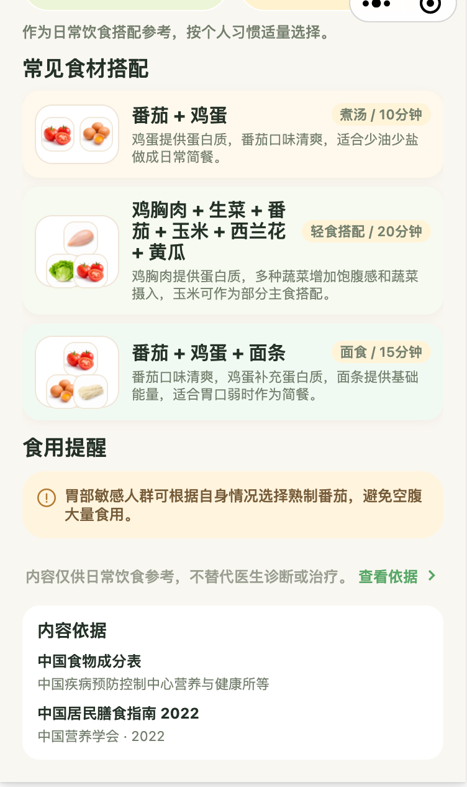
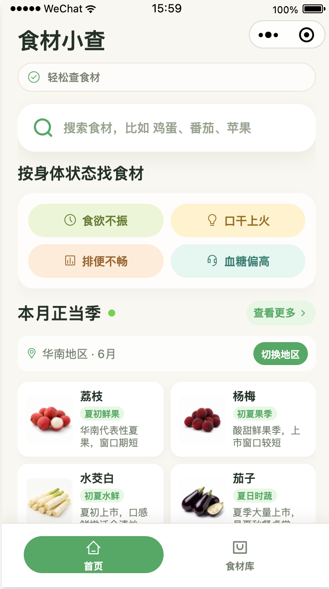
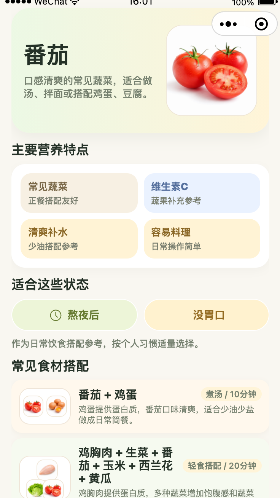

# 🥗 食材小查 (Food Ingredient Lookup)

微信小程序 MVP，帮助用户查询食材营养信息、按身体状况筛选食材、查看时令食材推荐和食材搭配方案。

## ✨ 功能特性

- 🔍 **食材搜索** - 按关键词快速查找食材
- 📊 **营养信息** - 查看食材的详细营养成分
- 💪 **身体状况筛选** - 根据熬夜、疲劳、便秘等状况推荐合适食材
- 🌸 **时令推荐** - 基于节气和区域的当季食材推荐
- 🍽️ **食材搭配** - 查看最佳食材搭配方案
- 📖 **知识来源** - 查看食材信息的权威来源

## 📱 项目截图

<div align="center">

**首页**
<br>



<br>

**食材库**
<br>



<br>

**食材详情页**
<br>




</div>

## 🛠️ 技术栈

- **前端框架**: uni-app CLI + Vue 3 + TypeScript + Vite
- **目标平台**: 微信小程序 (mp-weixin)
- **后端服务**: 微信云开发 (CloudBase)
- **UI 组件库**: wot-design-uni
- **状态管理**: Pinia
- **样式方案**: SCSS

## 🚀 快速开始

### 环境要求

- Node.js >= 16
- npm 或 yarn
- 微信开发者工具

### 安装依赖

```bash
npm install
```

### 开发运行

```bash
# 开发构建（输出到 dist/dev/mp-weixin/）
npm run dev:mp-weixin
```

然后用微信开发者工具打开 `dist/dev/mp-weixin/` 目录即可调试。

### 生产构建

```bash
npm run build:mp-weixin
```

## 📁 项目结构

```
food-ai/
├── src/
│   ├── api/                    # 云函数调用封装
│   │   └── cloud.ts
│   ├── config/                 # 配置文件
│   │   └── cloud.ts           # 云环境配置
│   ├── pages/
│   │   ├── index/             # 首页（体质筛选、时令推荐、搜索）
│   │   ├── ingredient-library/ # 食材库（分类浏览、关键词搜索）
│   │   └── ingredient-detail/  # 食材详情（营养、搭配、来源）
│   ├── styles/                 # 全局样式
│   │   └── variables.scss
│   ├── types/                  # TypeScript 类型定义
│   │   └── cloud.ts
│   ├── utils/                  # 工具函数
│   │   ├── cloud-image.ts     # 云文件 ID 转临时 URL
│   │   └── analytics.ts      # 埋点 SDK
│   └── main.ts                # 入口文件
├── cloudfunctions/             # 微信云函数
│   ├── getHomeData/           # 首页数据聚合
│   ├── getIngredientList/     # 食材列表（分页、搜索、筛选）
│   ├── getIngredientDetail/   # 食材详情（含搭配、来源）
│   ├── getIngredientCategories/ # 食材分类列表
│   ├── importKnowledgeData/   # 批量数据导入工具
│   ├── updateIngredientImageFileIds/ # 批量更新食材图片 ID
│   ├── renameCloudFile/       # 云存储文件重命名工具
│   └── logAnalyticsEvent/     # 埋点日志记录
├── scripts/                    # 数据管理脚本
│   ├── templates/             # 数据模板
│   └── *.json                # 数据导入配置
├── tests/                      # 测试文件
│   └── e2e/                   # E2E 测试
├── data/                       # 种子数据（本地）
├── package.json
├── tsconfig.json
├── vite.config.ts
└── cloudbaserc.json           # 云开发配置
```

## ☁️ 云开发配置

### 云环境 ID

配置文件位置：`src/config/cloud.ts`

```typescript
// 在 src/config/cloud.ts 中配置
export const CLOUD_ENV_ID = 'your-cloud-env-id'  // 替换为你的环境 ID
```

### 云数据库集合

需要在微信云开发控制台创建以下集合：

| 集合 | 主键 | 说明 |
|------|------|------|
| `ingredients` | `ingredientId` | 食材实体，含营养、标签、搭配引用 |
| `body_conditions` | `conditionId` | 身体状况（熬夜、疲劳、便秘等） |
| `ingredient_pairings` | `pairingId` | 食材搭配方案 |
| `condition_ingredient_rules` | `ruleId` | 体质-食材推荐规则 |
| `knowledge_sources` | `sourceId` | 知识来源引用 |
| `tag_dicts` | `tagId` + `tagType` | 标签字典 |
| `system_configs` | `configKey` | 系统配置 |
| `monthly_seasonal_rules` | `id` | 时令食材规则 |
| `region_mappings` | - | 省份-区域映射 |

### 初始化数据

种子数据位于 `data/` 目录，通过云函数导入：

```bash
# 提取种子数据到云初始化格式
npm run extract:cloud-data
```

然后在微信开发者工具中调用 `importKnowledgeData` 云函数导入数据。

## 🧪 测试

### 单元测试

```bash
# 运行云函数单元测试
npm test

# 运行 E2E 测试
npm run test:e2e
```

### 测试覆盖率

测试文件位于：
- `cloudfunctions/*/\*.test.js` - 云函数单元测试
- `tests/e2e/` - 微信小程序 E2E 测试

## 📦 数据导入

### 使用 scripts 目录

`scripts/` 目录包含数据管理脚本：

```bash
# 推送新食材数据
node scripts/push-new-ingredients.json

# 推送新搭配方案
node scripts/push-new-pairings.json
```

### 导入模式

- **append** - 追加新数据
- **upsert** - 按主键更新或插入

## 🚢 部署

### 微信开发者工具

1. 打开微信开发者工具
2. 导入 `dist/dev/mp-weixin/` 目录
3. 配置 AppID: `wxcadf76a84943b5cc`
4. 部署云函数到云环境

### 云函数部署

在微信开发者工具中右键点击云函数目录，选择"上传并部署"。

## 📝 开发规范

- **条件编译**: 微信相关代码用 `#ifdef MP-WEIXIN` 包裹
- **样式单位**: 使用 rpx 响应式单位
- **类型定义**: 所有云数据类型定义在 `src/types/cloud.ts`
- **错误处理**: 云函数统一响应格式 `{ success, code, message, data }`

## 🔧 常用命令

```bash
# 开发
npm run dev:mp-weixin          # 开发构建
npm run build:mp-weixin        # 生产构建
npm run type-check             # TypeScript 类型检查

# 测试
npm test                       # 运行单元测试
npm run test:e2e               # 运行 E2E 测试

# 数据
npm run extract:cloud-data     # 提取种子数据
```

## 📄 许可证

MIT License

## 🤝 贡献

欢迎提交 Issue 和 Pull Request！

## 📞 联系方式

如有问题，请提交 Issue 或联系项目维护者。
